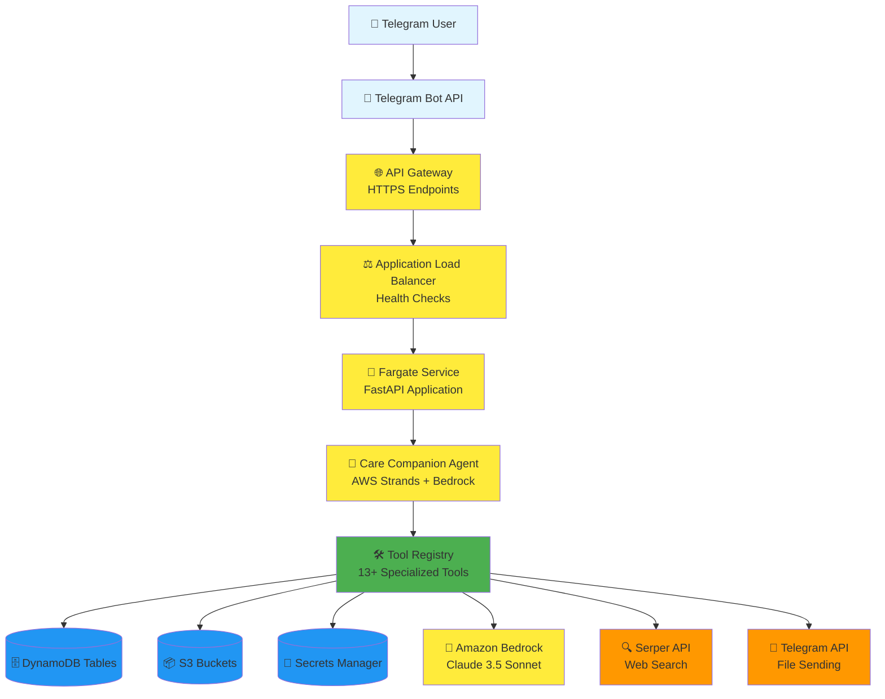
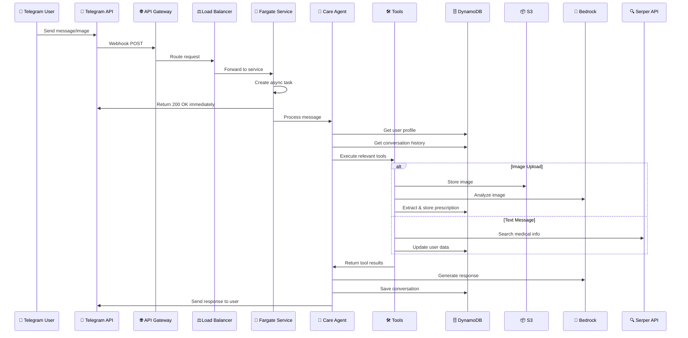
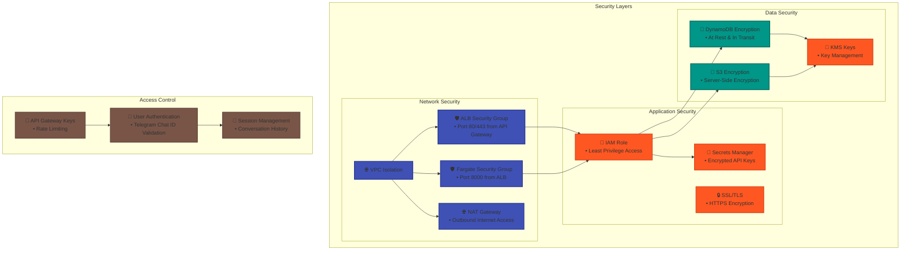
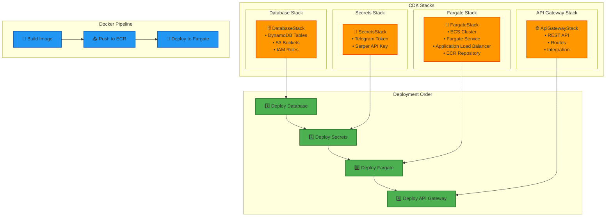

# Ctrl-Alt-Heal Architecture Diagram

## System Overview



## Detailed Component Architecture

```mermaid
graph TB
    %% User Interaction Flow
    subgraph "External Layer"
        User[👤 Telegram User]
        TG[📱 Telegram Bot API]
    end

    %% AWS Infrastructure
    subgraph "AWS Infrastructure"
        subgraph "API & Load Balancing"
            AGW[🌐 API Gateway<br/>• HTTPS Endpoints<br/>• CORS Support<br/>• Request Routing]
            ALB[⚖️ Application Load Balancer<br/>• Health Checks (/health)<br/>• Target Group<br/>• Security Groups]
        end

        subgraph "Compute Layer"
            subgraph "ECS Fargate"
                Fargate[🐳 Fargate Service<br/>• FastAPI Application<br/>• Uvicorn Server<br/>• Container Health]

                subgraph "Application Components"
                    Webhook[📥 Webhook Handler<br/>• Telegram Integration<br/>• Async Processing]
                    ChatAPI[💬 Chat Endpoints<br/>• Direct API Access<br/>• Streaming Responses]
                    AgentCore[🤖 Agent Orchestrator<br/>• Message Routing<br/>• Session Management]
                end
            end
        end

        subgraph "AI & Agent Layer"
            StrandsAgent[🧠 AWS Strands Agent<br/>• Care Companion (Cara)<br/>• Claude 3.5 Sonnet<br/>• System Prompt]

            subgraph "Tool Registry"
                PrescriptionTools[💊 Prescription Tools<br/>• Extraction<br/>• Scheduling<br/>• ICS Generation]
                UserTools[👤 User Tools<br/>• Profile Management<br/>• Identity Linking]
                MedicalTools[🏥 Medical Tools<br/>• Web Search<br/>• FHIR Storage]
                TimezoneTools[🌍 Timezone Tools<br/>• Detection<br/>• Calendar Integration]
                MediaTools[🖼️ Media Tools<br/>• Image Analysis<br/>• Description]
            end
        end

        subgraph "Data Layer"
            subgraph "DynamoDB Tables"
                Users[(👥 User Profiles<br/>• user_id PK)]
                Identities[(🔐 External Identities<br/>• identity_key PK)]
                Conversations[(💬 Conversation History<br/>• user_id PK, session_id SK)]
                Prescriptions[(💊 Medical Prescriptions<br/>• user_id PK, prescription_id SK)]
                FHIR[(🏥 FHIR Resources<br/>• user_id PK, resource_id SK)]
            end

            subgraph "S3 Storage"
                Uploads[(📁 User Uploads<br/>• Images, Files)]
                Assets[(📦 System Assets<br/>• System Prompt, Config)]
            end

            subgraph "Secrets Management"
                TelegramSecret[(🤖 Telegram Bot Token)]
                SerperSecret[(🔍 Serper API Key)]
            end
        end

        subgraph "AI Services"
            Bedrock[🧠 Amazon Bedrock<br/>• Claude 3.5 Sonnet<br/>• Model Inference]
        end
    end

    %% External Services
    subgraph "External APIs"
        SerperAPI[🔍 Serper API<br/>• Web Search<br/>• Medical Information]
        TelegramAPI[📡 Telegram API<br/>• Message Sending<br/>• File Uploads]
    end

    %% Network & Security
    subgraph "Network Layer"
        VPC[🌐 VPC<br/>• Private Subnets<br/>• Security Groups<br/>• NAT Gateway]
    end

    %% Data Flow Connections
    User --> TG
    TG --> AGW
    AGW --> ALB
    ALB --> Fargate

    Fargate --> Webhook
    Fargate --> ChatAPI
    Fargate --> AgentCore

    AgentCore --> StrandsAgent
    StrandsAgent --> PrescriptionTools
    StrandsAgent --> UserTools
    StrandsAgent --> MedicalTools
    StrandsAgent --> TimezoneTools
    StrandsAgent --> MediaTools

    %% Tool to Data Connections
    PrescriptionTools --> Prescriptions
    PrescriptionTools --> FHIR
    UserTools --> Users
    UserTools --> Identities
    MedicalTools --> Conversations
    TimezoneTools --> Users

    %% Media Processing
    MediaTools --> Uploads
    MediaTools --> Assets

    %% External API Connections
    MedicalTools --> SerperAPI
    PrescriptionTools --> TelegramAPI
    UserTools --> TelegramAPI

    %% AI Service Connections
    StrandsAgent --> Bedrock

    %% Secrets Access
    Fargate --> TelegramSecret
    Fargate --> SerperSecret

    %% Network Connections
    Fargate --> VPC
    ALB --> VPC

    %% Styling
    classDef external fill:#e1f5fe,stroke:#01579b,stroke-width:2px
    classDef aws fill:#ffeb3b,stroke:#f57f17,stroke-width:2px
    classDef compute fill:#4caf50,stroke:#2e7d32,stroke-width:2px
    classDef storage fill:#2196f3,stroke:#1565c0,stroke-width:2px
    classDef api fill:#ff9800,stroke:#e65100,stroke-width:2px
    classDef network fill:#9c27b0,stroke:#6a1b9a,stroke-width:2px

    class User,TG external
    class AGW,ALB,Fargate,Webhook,ChatAPI,AgentCore,StrandsAgent,Bedrock aws
    class PrescriptionTools,UserTools,MedicalTools,TimezoneTools,MediaTools compute
    class Users,Identities,Conversations,Prescriptions,FHIR,Uploads,Assets,TelegramSecret,SerperSecret storage
    class SerperAPI,TelegramAPI api
    class VPC network
```

## Data Flow Architecture



## Security Architecture



## Deployment Architecture



## Current Infrastructure Status

### ✅ **Deployed Components**
- **4 CDK Stacks**: All CREATE_COMPLETE/UPDATE_COMPLETE
- **1 Fargate Service**: 1/1 tasks running (ACTIVE)
- **1 API Gateway**: HTTPS endpoints accessible
  - **Base URL**: `https://x2ungeyw8c.execute-api.ap-southeast-1.amazonaws.com/production/`
  - **Webhook URL**: `https://x2ungeyw8c.execute-api.ap-southeast-1.amazonaws.com/production/webhook`
- **5 DynamoDB Tables**: All operational with proper schema
- **2 S3 Buckets**: User uploads and system assets
- **2 Secrets**: Telegram bot token and Serper API key

### 🔧 **Key Features**
- **Multi-modal Processing**: Text + Image support
- **Persistent Sessions**: User profiles and conversation history
- **Healthcare Standards**: FHIR-compliant data storage
- **Calendar Integration**: ICS file generation
- **Timezone Management**: Automatic detection and handling
- **Medical Information**: Web search integration

### 🚀 **Scalability**
- **Auto-scaling**: Fargate service can scale based on demand
- **Load Balancing**: ALB distributes traffic across tasks
- **Container-based**: Easy deployment and updates
- **Serverless**: No server management required

This architecture provides a robust, scalable, and secure foundation for the Ctrl-Alt-Heal healthcare assistant application.

## 🎯 **Current Deployment Status**

### **Infrastructure Health**
- ✅ **All CDK Stacks**: Successfully deployed and operational
- ✅ **Fargate Service**: Running with 1/1 tasks (ACTIVE status)
- ✅ **API Gateway**: All endpoints responding correctly
- ✅ **Database**: All tables operational with proper schema
- ✅ **Secrets**: Securely stored and accessible
- ✅ **Telegram Integration**: Webhook configured and functional

### **Recent Improvements**
- 🔧 **Schema Alignment**: Fixed DynamoDB schema mismatches
- 🔧 **FhirStore Consolidation**: Removed duplicate implementations
- 🔧 **Error Handling**: Enhanced session management and error recovery
- 🔧 **Docker Optimization**: Fixed architecture compatibility issues

### **System Capabilities**
- 🚀 **Multi-modal Processing**: Text and image support
- 🚀 **Healthcare Standards**: FHIR-compliant data storage
- 🚀 **Calendar Integration**: ICS file generation
- 🚀 **Timezone Management**: Automatic detection and handling
- 🚀 **Medical Information**: Web search integration
- 🚀 **Persistent Sessions**: User profiles and conversation history
