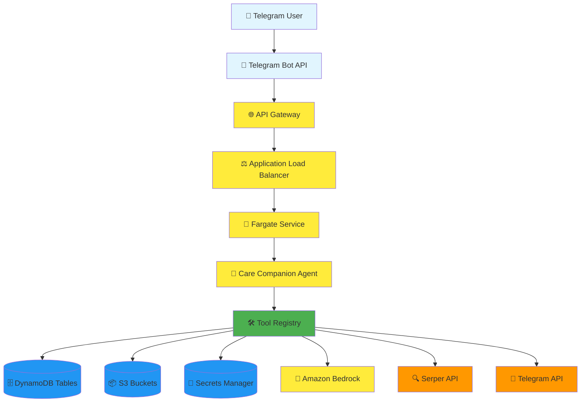
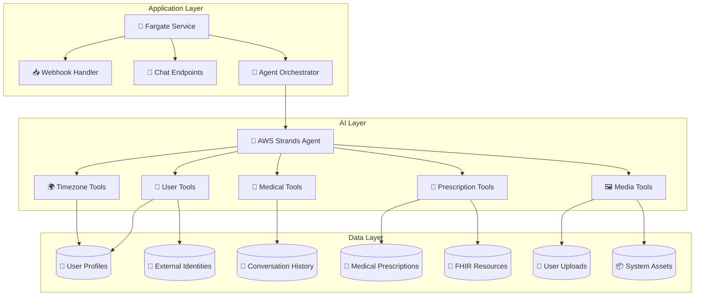
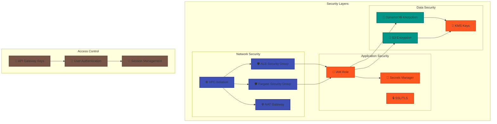
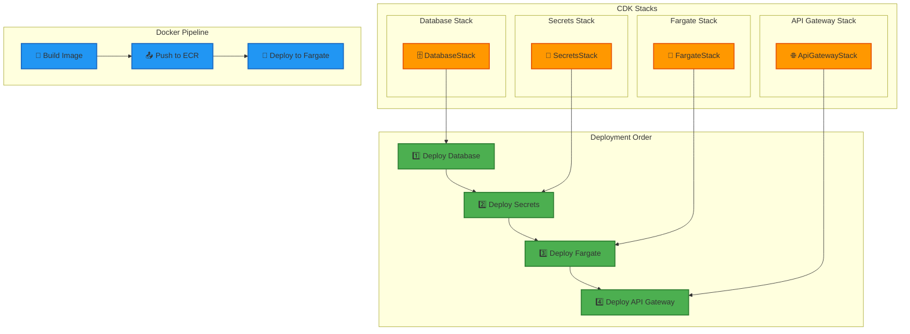

# Ctrl-Alt-Heal Architecture Diagram

## System Overview

## Application Components

## Data Flow Architecture

## Security Architecture

## Deployment Architecture

## Current Infrastructure Status

### ✅ **Deployed Components**
- **4 CDK Stacks**: All CREATE_COMPLETE/UPDATE_COMPLETE
- **1 Fargate Service**: 1/1 tasks running (ACTIVE)
- **1 API Gateway**: HTTPS endpoints accessible
  - **Base URL**: `https://x2ungeyw8c.execute-api.ap-southeast-1.amazonaws.com/production/`
  - **Webhook URL**: `https://x2ungeyw8c.execute-api.ap-southeast-1.amazonaws.com/production/webhook`
- **5 DynamoDB Tables**: All operational with proper schema
- **2 S3 Buckets**: User uploads and system assets
- **2 Secrets**: Telegram bot token and Serper API key

### 🔧 **Key Features**
- **Multi-modal Processing**: Text + Image support
- **Persistent Sessions**: User profiles and conversation history
- **Healthcare Standards**: FHIR-compliant data storage
- **Calendar Integration**: ICS file generation
- **Timezone Management**: Automatic detection and handling
- **Medical Information**: Web search integration

### 🚀 **Scalability**
- **Auto-scaling**: Fargate service can scale based on demand
- **Load Balancing**: ALB distributes traffic across tasks
- **Container-based**: Easy deployment and updates
- **Serverless**: No server management required

This architecture provides a robust, scalable, and secure foundation for the Ctrl-Alt-Heal healthcare assistant application.

## 🎯 **Current Deployment Status**

### **Infrastructure Health**
- ✅ **All CDK Stacks**: Successfully deployed and operational
- ✅ **Fargate Service**: Running with 1/1 tasks (ACTIVE status)
- ✅ **API Gateway**: All endpoints responding correctly
- ✅ **Database**: All tables operational with proper schema
- ✅ **Secrets**: Securely stored and accessible
- ✅ **Telegram Integration**: Webhook configured and functional

### **Recent Improvements**
- 🔧 **Schema Alignment**: Fixed DynamoDB schema mismatches
- 🔧 **FhirStore Consolidation**: Removed duplicate implementations
- 🔧 **Error Handling**: Enhanced session management and error recovery
- 🔧 **Docker Optimization**: Fixed architecture compatibility issues

### **System Capabilities**
- 🚀 **Multi-modal Processing**: Text and image support
- 🚀 **Healthcare Standards**: FHIR-compliant data storage
- 🚀 **Calendar Integration**: ICS file generation
- 🚀 **Timezone Management**: Automatic detection and handling
- 🚀 **Medical Information**: Web search integration
- 🚀 **Persistent Sessions**: User profiles and conversation history
