# Ctrl-Alt-Heal Architecture Diagram

## System Overview

```mermaid
graph TB
    User["👤 Telegram User"] --> TG["📱 Telegram Bot API"]
    TG --> AGW["🌐 API Gateway"]
    AGW --> ALB["⚖️ Application Load Balancer"]
    ALB --> Fargate["🐳 Fargate Service"]
    Fargate --> Agent["🤖 Care Companion Agent"]
    Agent --> Tools["🛠️ Tool Registry"]
    Tools --> DynamoDB[("🗄️ DynamoDB Tables")]
    Tools --> S3[("📦 S3 Buckets")]
    Tools --> Secrets[("🔐 Secrets Manager")]
    Tools --> Bedrock["🧠 Amazon Bedrock"]
    Tools --> Serper["🔍 Serper API"]
    Tools --> TelegramAPI["📡 Telegram API"]

    %% Data Flow Styling
    classDef external fill:#e1f5fe
    classDef aws fill:#ffeb3b
    classDef compute fill:#4caf50
    classDef storage fill:#2196f3
    classDef api fill:#ff9800

    class User,TG external
    class AGW,ALB,Fargate,Agent,Bedrock aws
    class Tools compute
    class DynamoDB,S3,Secrets storage
    class Serper,TelegramAPI api
```

## Application Components

```mermaid
graph TB
    subgraph "Application Layer"
        Fargate["🐳 Fargate Service"]
        Webhook["📥 Webhook Handler"]
        ChatAPI["💬 Chat Endpoints"]
        AgentCore["🤖 Agent Orchestrator"]
    end

    subgraph "AI Layer"
        StrandsAgent["🧠 AWS Strands Agent"]
        PrescriptionTools["💊 Prescription Tools"]
        UserTools["👤 User Tools"]
        MedicalTools["🏥 Medical Tools"]
        TimezoneTools["🌍 Timezone Tools"]
        MediaTools["🖼️ Media Tools"]
    end

    subgraph "Data Layer"
        Users[("👥 User Profiles")]
        Identities[("🔐 External Identities")]
        Conversations[("💬 Conversation History")]
        Prescriptions[("💊 Medical Prescriptions")]
        FHIR[("🏥 FHIR Resources")]
        Uploads[("📁 User Uploads")]
        Assets[("📦 System Assets")]
    end

    Fargate --> Webhook
    Fargate --> ChatAPI
    Fargate --> AgentCore
    AgentCore --> StrandsAgent
    StrandsAgent --> PrescriptionTools
    StrandsAgent --> UserTools
    StrandsAgent --> MedicalTools
    StrandsAgent --> TimezoneTools
    StrandsAgent --> MediaTools

    PrescriptionTools --> Prescriptions
    PrescriptionTools --> FHIR
    UserTools --> Users
    UserTools --> Identities
    MedicalTools --> Conversations
    TimezoneTools --> Users
    MediaTools --> Uploads
    MediaTools --> Assets
```

## Data Flow Architecture

## Security Architecture

```mermaid
graph TB
    subgraph "Security Layers"
        subgraph "Network Security"
            VPC["🌐 VPC Isolation"]
            SG_ALB["🛡️ ALB Security Group"]
            SG_Fargate["🛡️ Fargate Security Group"]
            NAT["🌐 NAT Gateway"]
        end

        subgraph "Application Security"
            IAM_Role["🔑 IAM Role"]
            Secrets["🔐 Secrets Manager"]
            SSL["🔒 SSL/TLS"]
        end

        subgraph "Data Security"
            DDB_Encryption["🔐 DynamoDB Encryption"]
            S3_Encryption["🔐 S3 Encryption"]
            KMS["🔑 KMS Keys"]
        end
    end

    subgraph "Access Control"
        API_Key["🔑 API Gateway Keys"]
        User_Auth["👤 User Authentication"]
        Session_Mgmt["💬 Session Management"]
    end

    %% Connections
    VPC --> SG_ALB
    VPC --> SG_Fargate
    VPC --> NAT

    SG_ALB --> IAM_Role
    SG_Fargate --> IAM_Role

    IAM_Role --> Secrets
    IAM_Role --> DDB_Encryption
    IAM_Role --> S3_Encryption

    DDB_Encryption --> KMS
    S3_Encryption --> KMS

    API_Key --> User_Auth
    User_Auth --> Session_Mgmt

    %% Styling
    classDef security fill:#ff5722,stroke:#d84315,stroke-width:2px
    classDef network fill:#3f51b5,stroke:#283593,stroke-width:2px
    classDef data fill:#009688,stroke:#00695c,stroke-width:2px
    classDef access fill:#795548,stroke:#5d4037,stroke-width:2px

    class IAM_Role,Secrets,SSL,KMS security
    class VPC,SG_ALB,SG_Fargate,NAT network
    class DDB_Encryption,S3_Encryption data
    class API_Key,User_Auth,Session_Mgmt access
```

## Deployment Architecture

## Current Infrastructure Status

### ✅ **Deployed Components**
- **4 CDK Stacks**: All CREATE_COMPLETE/UPDATE_COMPLETE
- **1 Fargate Service**: 1/1 tasks running (ACTIVE)
- **1 API Gateway**: HTTPS endpoints accessible
  - **Base URL**: `https://x2ungeyw8c.execute-api.ap-southeast-1.amazonaws.com/production/`
  - **Webhook URL**: `https://x2ungeyw8c.execute-api.ap-southeast-1.amazonaws.com/production/webhook`
- **5 DynamoDB Tables**: All operational with proper schema
- **2 S3 Buckets**: User uploads and system assets
- **2 Secrets**: Telegram bot token and Serper API key

### 🔧 **Key Features**
- **Multi-modal Processing**: Text + Image support
- **Persistent Sessions**: User profiles and conversation history
- **Healthcare Standards**: FHIR-compliant data storage
- **Calendar Integration**: ICS file generation
- **Timezone Management**: Automatic detection and handling
- **Medical Information**: Web search integration

### 🚀 **Scalability**
- **Auto-scaling**: Fargate service can scale based on demand
- **Load Balancing**: ALB distributes traffic across tasks
- **Container-based**: Easy deployment and updates
- **Serverless**: No server management required

This architecture provides a robust, scalable, and secure foundation for the Ctrl-Alt-Heal healthcare assistant application.

## 🎯 **Current Deployment Status**

### **Infrastructure Health**
- ✅ **All CDK Stacks**: Successfully deployed and operational
- ✅ **Fargate Service**: Running with 1/1 tasks (ACTIVE status)
- ✅ **API Gateway**: All endpoints responding correctly
- ✅ **Database**: All tables operational with proper schema
- ✅ **Secrets**: Securely stored and accessible
- ✅ **Telegram Integration**: Webhook configured and functional

### **Recent Improvements**
- 🔧 **Schema Alignment**: Fixed DynamoDB schema mismatches
- 🔧 **FhirStore Consolidation**: Removed duplicate implementations
- 🔧 **Error Handling**: Enhanced session management and error recovery
- 🔧 **Docker Optimization**: Fixed architecture compatibility issues

### **System Capabilities**
- 🚀 **Multi-modal Processing**: Text and image support
- 🚀 **Healthcare Standards**: FHIR-compliant data storage
- 🚀 **Calendar Integration**: ICS file generation
- 🚀 **Timezone Management**: Automatic detection and handling
- 🚀 **Medical Information**: Web search integration
- 🚀 **Persistent Sessions**: User profiles and conversation history
