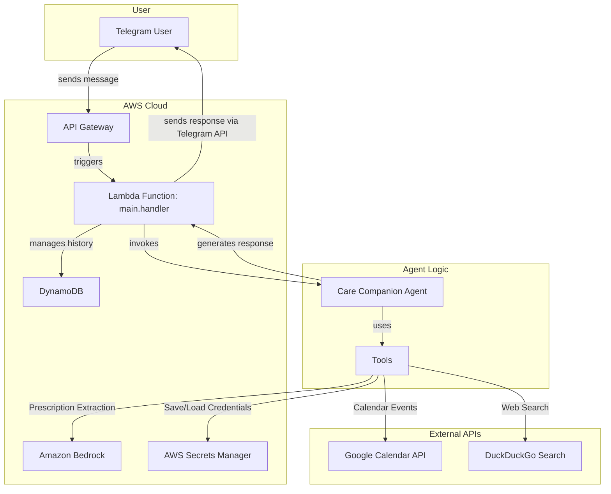
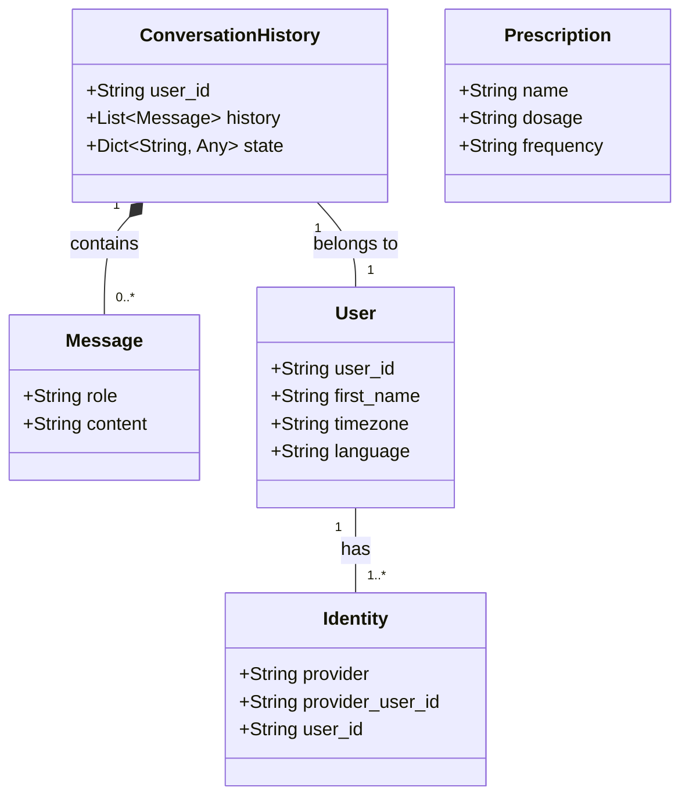
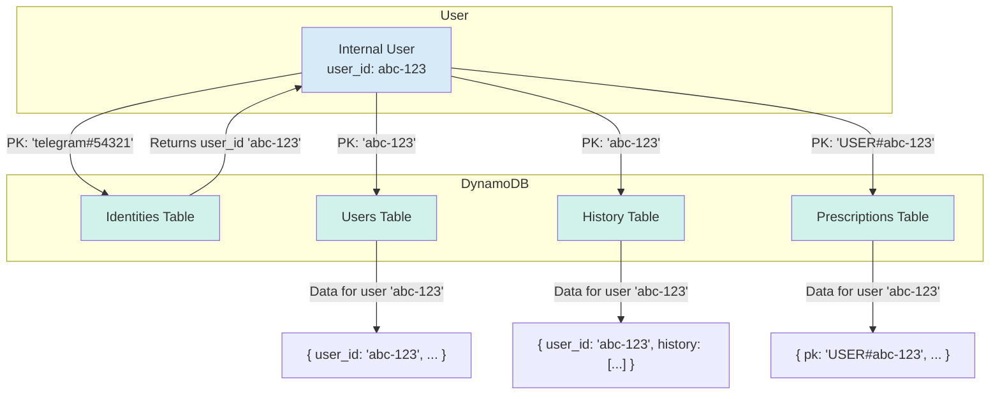
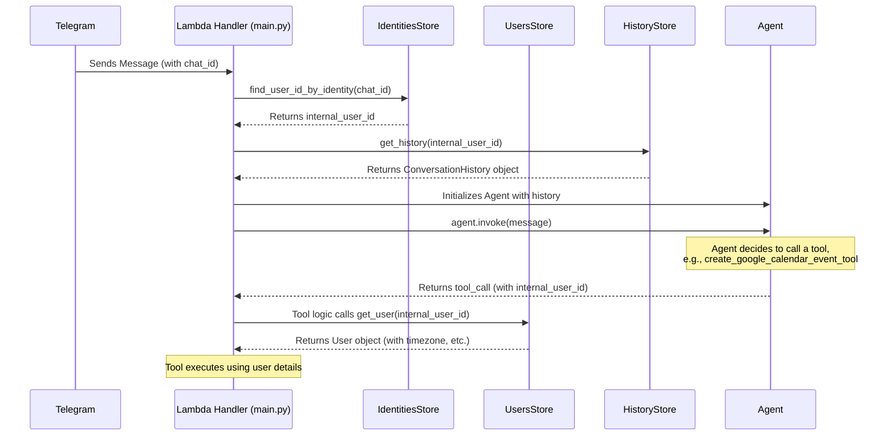

# Ctrl-Alt-Heal Architecture Documentation

This document provides an overview of the architecture for the Ctrl-Alt-Heal application, a serverless, AI-powered "Care Companion" agent.

## High-Level Architecture

The application is designed around a central AI agent that leverages a collection of tools to perform specific tasks. It's a serverless architecture where an AWS Lambda function acts as the main entry point, processing webhooks from Telegram.



## Data Models

We use Pydantic `BaseModel`s to define our core data types. This provides strong data validation, serialization, and a clear structure.



## Data Tracking Across DynamoDB Tables

We track user data across all DynamoDB tables using a single, consistent identifier: the internal `user_id`. This `user_id` acts as a foreign key, linking all of a user's records together.



## User Identity: Find-or-Create Workflow

The creation and storage of our internal `user_id` is a critical process that happens automatically the very first time a new user sends a message to our bot.

```mermaid
graph TD
    A[Start: Message Received from Telegram] --> B{Extract Telegram chat_id};
    B --> C{Find user_id in Identities table<br>using chat_id};
    C -->|Found| D[Use existing internal user_id];
    C -->|Not Found| E[Create New User in Users Table<br>(with auto-generated UUID)];
    E --> G[Create New Record in Identities Table<br>(Link chat_id to user_id)];
    G --> D;
    D --> H[Proceed with Agent Logic...];

    style E fill:#D5F5E3
    style G fill:#D5F5E3
```

## Agent Context Retrieval Flow

Once the handler has the internal `user_id`, it uses that single ID to fetch all the necessary context for the agent. User-specific details (like timezone) are retrieved on-demand by the tools when they are needed.



This is a living document and should be updated as the application evolves.

### Deployment

The entire application infrastructure is defined as code using the AWS Cloud Development Kit (CDK) in the `cdk/` directory. This allows for automated, repeatable, and version-controlled deployments.

The infrastructure is divided into three logical stacks:
-   **`DatabaseStack`**: Provisions all five DynamoDB tables (`Users`, `Identities`, `History`, `Prescriptions`, `FHIR`).
-   **`LambdaStack`**: Creates the main Python Lambda function, a Lambda Layer for its dependencies, and the necessary IAM Role with permissions to access the databases and other AWS services.
-   **`ApiGatewayStack`**: Sets up the public HTTP API Gateway that receives webhooks from Telegram and triggers the Lambda function.

#### Deployment Prerequisites
1.  **AWS CDK Toolkit**: Must be installed globally (`npm install -g aws-cdk`).
2.  **AWS Credentials**: Your environment must be configured with AWS credentials that have permission to create the necessary resources. This is typically done via the AWS CLI (`aws configure`).

#### How to Deploy
1.  Navigate to the CDK directory: `cd cdk`
2.  Activate the CDK's virtual environment: `source .venv/bin/activate`
3.  Install CDK Python dependencies: `pip install -r requirements.txt`
4.  Bootstrap your AWS environment (only needs to be done once per account/region): `cdk bootstrap --profile YOUR_PROFILE_NAME`
5.  Deploy all stacks: `cdk deploy --all --profile YOUR_PROFILE_NAME`

After a successful deployment, the CDK will output the API Gateway endpoint URL, which can then be set as the webhook for the Telegram bot.
