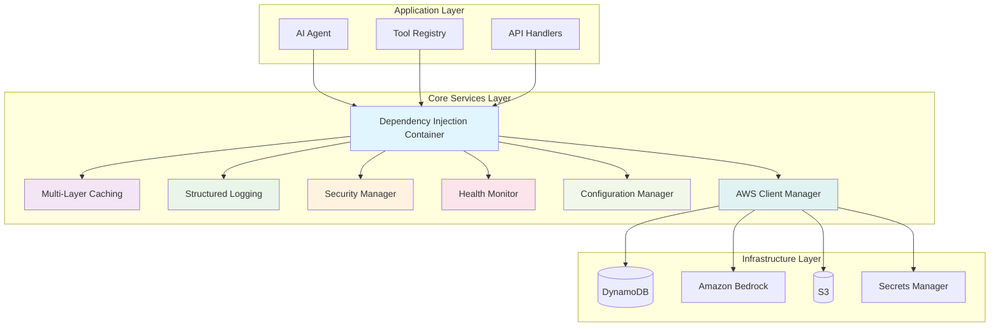
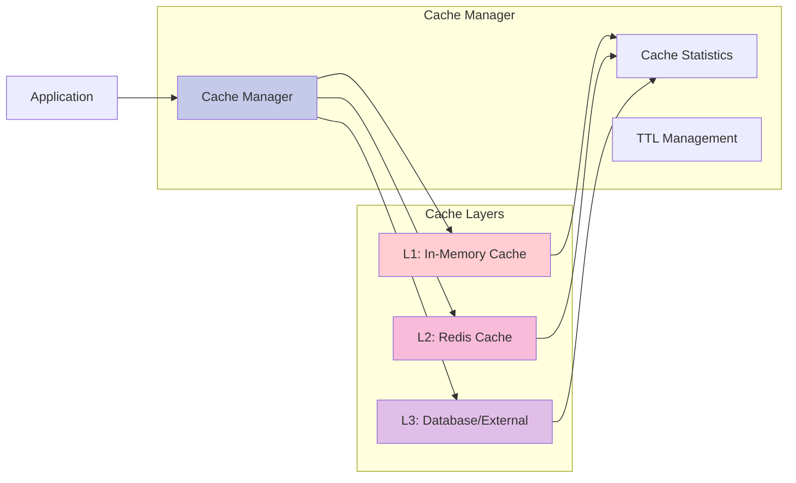
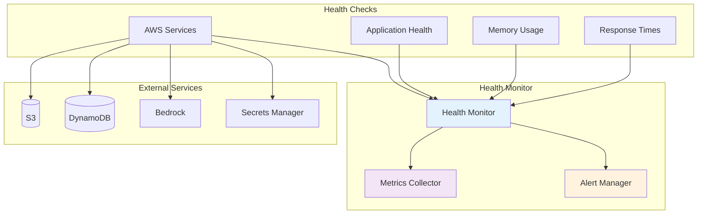
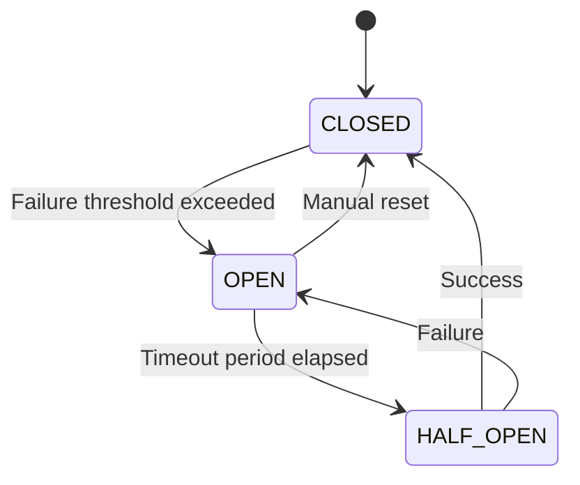

# Core Services Documentation

This document provides comprehensive documentation for the core services that form the foundation of the Ctrl-Alt-Heal application.

## 🏗️ **Architecture Overview**

The core services are built using modern software engineering patterns to ensure scalability, maintainability, and reliability:



## 🔧 **Dependency Injection Container**

### Overview

The dependency injection container provides a clean, testable architecture by managing service dependencies and lifecycle.

### Key Features

- **Service Registration**: Register services with different lifecycle scopes
- **Automatic Resolution**: Resolve dependencies automatically
- **Factory Support**: Create services using factory functions
- **Optional Dependencies**: Handle optional service dependencies gracefully

### Usage Examples

```python
from ctrl_alt_heal.core.container import get_container, inject

# Register a service
container = get_container()
container.register_singleton('cache_manager', CacheManager)
container.register_factory('logger', lambda: StructuredLogger())

# Inject dependencies
@inject('cache_manager', 'logger')
def my_service(cache_manager, logger):
    logger.info("Service initialized")
    return cache_manager.get('key')
```

### Service Lifecycles

| Lifecycle | Description | Use Case |
|-----------|-------------|----------|
| **Singleton** | Single instance for entire application | Cache managers, configuration |
| **Transient** | New instance each time | Request-scoped services |
| **Factory** | Custom creation logic | Complex initialization |

## 💾 **Multi-Layer Caching System**

### Architecture

The caching system provides multiple layers of caching for optimal performance:



### Features

- **Multi-Layer Strategy**: In-memory → Redis → Database fallback
- **TTL Management**: Automatic expiration and cleanup
- **Cache Statistics**: Performance monitoring and metrics
- **Decorator Support**: Easy caching with `@cache_result`

### Usage Examples

```python
from ctrl_alt_heal.core.caching import cache_result, get_cache_manager

# Simple caching
@cache_result(ttl=300)  # 5 minutes
def get_user_profile(user_id: str):
    return fetch_user_from_database(user_id)

# Manual caching
cache = get_cache_manager()
cache.set('user:123', user_data, ttl=600)
user = cache.get('user:123')
```

### Cache Configuration

```python
# Cache configuration (Redis is optional)
CACHE_CONFIG = {
    'memory': {
        'max_size': 1000,
        'ttl': 300
    }
    # Redis configuration (optional - requires redis package)
    # 'redis': {
    #     'host': 'localhost',
    #     'port': 6379,
    #     'ttl': 3600
    # }
}
```

## 📝 **Structured Logging System**

### Features

- **Structured JSON Logging**: Machine-readable log format
- **Correlation IDs**: Track requests across services
- **Performance Tracking**: Automatic timing and metrics
- **Audit Logging**: Security and compliance logging
- **Log Levels**: Configurable logging levels

### Log Format

```json
{
  "timestamp": "2024-12-15T10:30:00Z",
  "level": "INFO",
  "correlation_id": "req-12345",
  "service": "ctrl-alt-heal",
  "module": "user_service",
  "function": "get_user_profile",
  "message": "User profile retrieved successfully",
  "user_id": "user-123",
  "performance": {
    "duration_ms": 45,
    "operation": "database_query"
  },
  "metadata": {
    "cache_hit": false,
    "source": "database"
  }
}
```

### Usage Examples

```python
from ctrl_alt_heal.core.logging import get_logger, log_performance

logger = get_logger(__name__)

# Basic logging
logger.info("User authenticated", user_id="user-123")

# Performance tracking
@log_performance
def expensive_operation():
    # Operation code here
    pass

# Audit logging
logger.audit("user_login", user_id="user-123", ip="192.168.1.1")
```

## 🔒 **Security Manager**

### Security Features

- **Input Sanitization**: XSS, SQL injection, command injection protection
- **Rate Limiting**: Prevent abuse and DoS attacks
- **Audit Logging**: Security event tracking
- **Suspicious Activity Detection**: Automated threat detection

### Security Levels

| Level | Description | Protection |
|-------|-------------|------------|
| **LOW** | Basic sanitization | HTML entities, basic SQL |
| **MEDIUM** | Enhanced protection | XSS, SQL injection, command injection |
| **HIGH** | Maximum security | All protections + additional validation |

### Usage Examples

```python
from ctrl_alt_heal.core.security_manager import get_security_manager

security = get_security_manager()

# Sanitize input
clean_input = security.sanitize_input(user_input, level=SecurityLevel.HIGH)

# Rate limiting
if security.is_rate_limited(user_id):
    raise RateLimitError("Too many requests")

# Security audit
security.log_security_event(
    event_type="login_attempt",
    user_id=user_id,
    ip_address=ip,
    success=False
)
```

### Security Patterns

```python
# Input validation pattern
@validate_input
def process_user_data(data: dict):
    # Data is automatically sanitized
    return process_data(data)

# Rate limiting pattern
@rate_limit(max_requests=100, window_seconds=3600)
def api_endpoint():
    # Endpoint logic here
    pass
```

## 📊 **Health Monitoring System**

### Monitoring Components



### Health Check Types

| Check Type | Description | Metrics | Dependencies |
|------------|-------------|---------|--------------|
| **AWS Services** | Connectivity and performance | Response time, availability | None |
| **Application Health** | Application state | Memory usage, CPU usage | psutil (optional) |
| **Memory Usage** | System memory monitoring | Used memory, available memory | psutil (optional) |
| **Response Times** | API performance | Average, p95, p99 response times | None |

### Usage Examples

```python
from ctrl_alt_heal.core.health_monitor import get_health_monitor

monitor = get_health_monitor()

# Run health checks
health_status = monitor.run_health_checks()

# Get health summary
summary = monitor.get_health_summary()

# Record custom metrics
monitor.record_metric(
    name="api_response_time",
    value=150.5,
    unit="ms",
    tags={"endpoint": "/api/users"}
)
```

### Health Status Levels

| Status | Description | Action Required |
|--------|-------------|-----------------|
| **HEALTHY** | All systems operational | None |
| **DEGRADED** | Some issues detected | Monitor closely |
| **CRITICAL** | Major issues detected | Immediate attention |
| **UNKNOWN** | Unable to determine status | Investigate |

## ⚙️ **Configuration Management**

### Features

- **Environment Validation**: Validate required environment variables
- **Feature Flags**: Dynamic feature enabling/disabling
- **Configuration Sources**: Multiple configuration sources
- **Hot Reloading**: Dynamic configuration updates

### Configuration Sources

```python
# Configuration sources priority
CONFIG_SOURCES = [
    'environment_variables',  # Highest priority
    'secrets_manager',
    'parameter_store',
    'config_files',
    'defaults'               # Lowest priority
]
```

### Usage Examples

```python
from ctrl_alt_heal.core.config_manager import get_config_manager

config = get_config_manager()

# Get configuration value
db_url = config.get('database.url', default='sqlite:///app.db')

# Feature flags
if config.get('features.new_ui', default=False):
    enable_new_ui()

# Environment validation
config.validate_required(['DATABASE_URL', 'API_KEY'])
```

### Feature Flags

```python
# Feature flag configuration
FEATURE_FLAGS = {
    'new_medication_ui': {
        'enabled': True,
        'rollout_percentage': 50,
        'description': 'New medication management interface'
    },
    'advanced_analytics': {
        'enabled': False,
        'description': 'Advanced analytics dashboard'
    }
}
```

## 🔌 **AWS Client Manager**

### Features

- **Circuit Breaker Pattern**: Resilient service integration
- **Connection Pooling**: Optimized AWS client management
- **Health Checks**: Service availability monitoring
- **Automatic Retry**: Intelligent retry logic

### Circuit Breaker States



### Usage Examples

```python
from ctrl_alt_heal.core.aws_client_manager import get_aws_client

# Get AWS client with circuit breaker
s3_client = get_aws_client('s3')

# Execute with circuit breaker protection
result = execute_aws_operation(
    service='dynamodb',
    operation='get_item',
    params={'TableName': 'users', 'Key': {'id': 'user-123'}}
)

# Health check
health_status = get_aws_service_status()
```

### Circuit Breaker Configuration

```python
CIRCUIT_BREAKER_CONFIG = {
    'failure_threshold': 5,
    'recovery_timeout': 60,
    'expected_exception': (Exception,),
    'monitor_interval': 10
}
```

## 🧪 **Testing Support**

### Testing Utilities

```python
# Mock container for testing
from ctrl_alt_heal.core.container import ServiceProvider

def test_with_mocks():
    with ServiceProvider() as provider:
        provider.register_singleton('cache_manager', MockCacheManager)
        provider.register_singleton('logger', MockLogger)

        # Test code here
        service = provider.resolve(MyService)
        result = service.process_data()

        assert result is not None
```

### Performance Testing

```python
# Performance testing utilities
from ctrl_alt_heal.core.logging import PerformanceTracker

def test_performance():
    with PerformanceTracker('test_operation') as tracker:
        # Operation code here
        result = expensive_operation()

        # Performance assertions
        assert tracker.duration_ms < 100
        return result
```

## 📈 **Performance Metrics**

### Key Metrics

| Metric | Description | Target |
|--------|-------------|--------|
| **Response Time** | API response time | < 200ms |
| **Cache Hit Rate** | Cache effectiveness | > 80% |
| **Error Rate** | Error percentage | < 1% |
| **Memory Usage** | Application memory | < 512MB |
| **CPU Usage** | CPU utilization | < 70% |

### Monitoring Dashboard

```python
# Get system metrics
metrics = get_metrics()

# Performance summary
summary = {
    'response_time_avg': metrics.get('api_response_time').average,
    'cache_hit_rate': metrics.get('cache_hit_rate').latest,
    'error_rate': metrics.get('error_rate').latest,
    'memory_usage': metrics.get('memory_usage').latest
}
```

## 🔄 **Integration Patterns**

### Service Integration

```python
# Service integration example
class UserService:
    def __init__(self):
        self.cache = get_cache_manager()
        self.logger = get_logger(__name__)
        self.security = get_security_manager()

    @cache_result(ttl=300)
    @log_performance
    def get_user(self, user_id: str):
        # Input validation
        user_id = self.security.sanitize_input(user_id)

        # Business logic
        user = self._fetch_user(user_id)

        # Logging
        self.logger.info("User retrieved", user_id=user_id)

        return user
```

### Error Handling

```python
# Comprehensive error handling
@handle_errors
def robust_operation():
    try:
        # Operation code
        result = perform_operation()
        return result
    except ValidationError as e:
        logger.warning("Validation error", error=str(e))
        raise
    except AWSServiceError as e:
        logger.error("AWS service error", error=str(e))
        # Circuit breaker will handle this
        raise
    except Exception as e:
        logger.error("Unexpected error", error=str(e))
        raise
```

---

## 📚 **Additional Resources**

- [API Reference](./api-reference.md) - Complete API documentation
- [Security Guide](./security.md) - Security best practices
- [Performance Guide](./performance.md) - Performance optimization
- [Troubleshooting](./troubleshooting.md) - Common issues and solutions

---

**Last Updated**: December 2024
**Version**: 2.0.0
**Status**: Production Ready ✅
