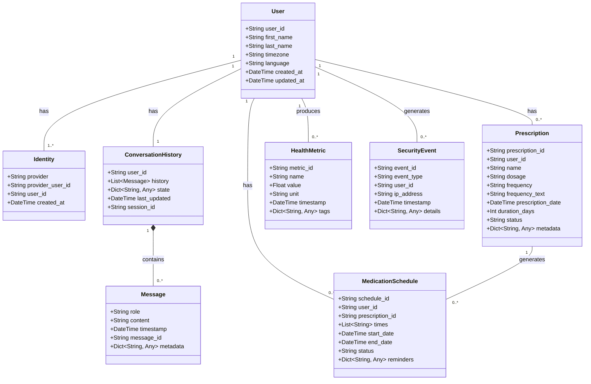
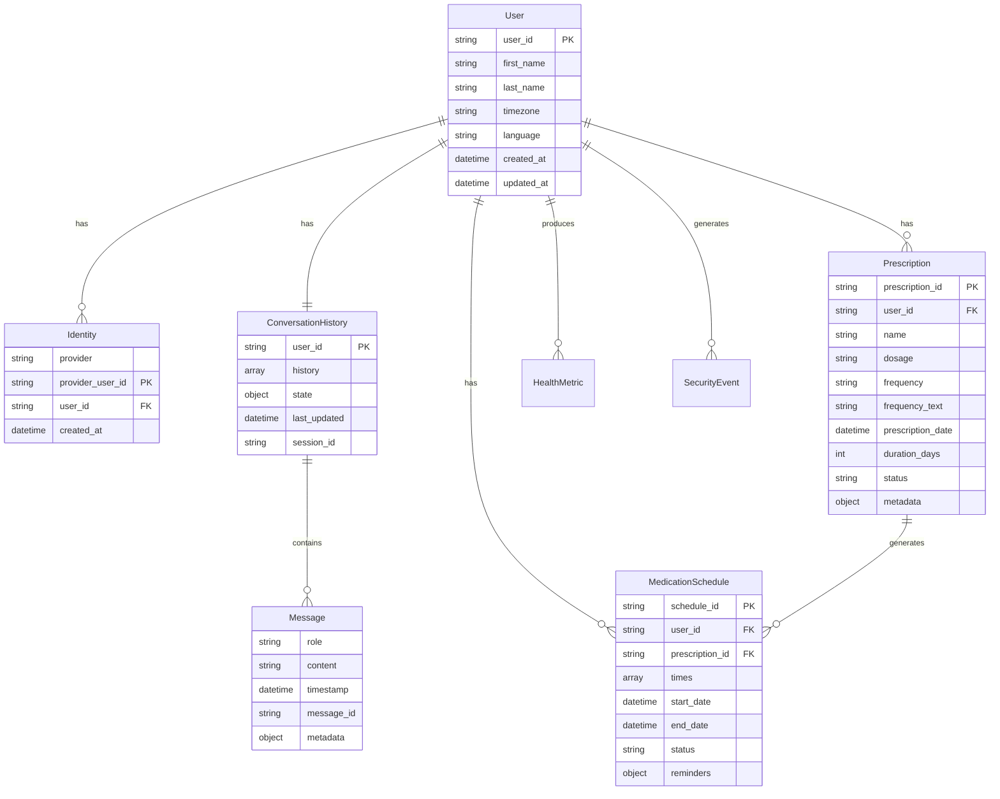

# Data Models Documentation

This document provides comprehensive documentation for all data models used in the Ctrl-Alt-Heal application.

## 🏗️ **Model Architecture Overview**

The data models follow a domain-driven design approach with clear separation of concerns:



## 👤 **User Management Models**

### User Model

The core user entity representing a patient in the system.

```python
class User(BaseModel):
    user_id: str = Field(..., description="Unique user identifier")
    first_name: Optional[str] = Field(None, description="User's first name")
    last_name: Optional[str] = Field(None, description="User's last name")
    timezone: Optional[str] = Field(None, description="User's timezone")
    language: Optional[str] = Field(None, description="User's preferred language")
    created_at: datetime = Field(default_factory=datetime.utcnow)
    updated_at: datetime = Field(default_factory=datetime.utcnow)

    class Config:
        json_encoders = {datetime: lambda v: v.isoformat()}
```

**Key Features:**
- **Unique Identification**: UUID-based user identification
- **Timezone Support**: Automatic timezone handling for medication schedules
- **Multi-language Support**: Language preference for localized responses
- **Audit Trail**: Creation and update timestamps

### Identity Model

Represents external identity providers (Telegram, etc.) linked to internal users.

```python
class Identity(BaseModel):
    provider: str = Field(..., description="Identity provider (e.g., 'telegram')")
    provider_user_id: str = Field(..., description="Provider-specific user ID")
    user_id: str = Field(..., description="Internal user ID")
    created_at: datetime = Field(default_factory=datetime.utcnow)

    class Config:
        json_encoders = {datetime: lambda v: v.isoformat()}
```

**Key Features:**
- **Provider Agnostic**: Supports multiple identity providers
- **Linking**: Maps external IDs to internal user IDs
- **Audit Trail**: Creation timestamp for compliance

## 💬 **Conversation Models**

### ConversationHistory Model

Manages conversation state and message history for each user.

```python
class ConversationHistory(BaseModel):
    user_id: str = Field(..., description="User identifier")
    history: List[Message] = Field(default_factory=list, description="Message history")
    state: Dict[str, Any] = Field(default_factory=dict, description="Conversation state")
    last_updated: datetime = Field(default_factory=datetime.utcnow)
    session_id: Optional[str] = Field(None, description="Current session identifier")

    class Config:
        json_encoders = {datetime: lambda v: v.isoformat()}
```

**Key Features:**
- **Session Management**: Tracks active conversation sessions
- **State Persistence**: Maintains conversation context
- **History Management**: Intelligent history truncation and summarization
- **Inactivity Tracking**: Session timeout based on inactivity

### Message Model

Represents individual messages in conversations.

```python
class Message(BaseModel):
    role: str = Field(..., description="Message role (user, assistant, system)")
    content: str = Field(..., description="Message content")
    timestamp: datetime = Field(default_factory=datetime.utcnow)
    message_id: Optional[str] = Field(None, description="Unique message identifier")
    metadata: Dict[str, Any] = Field(default_factory=dict, description="Additional metadata")

    class Config:
        json_encoders = {datetime: lambda v: v.isoformat()}
```

**Key Features:**
- **Role-based Messages**: Distinguishes between user, assistant, and system messages
- **Metadata Support**: Extensible metadata for additional context
- **Timestamp Tracking**: Precise timing for audit trails
- **Unique Identification**: Optional message IDs for tracking

## 💊 **Healthcare Models**

### Prescription Model

Represents medical prescriptions with comprehensive medication information.

```python
class Prescription(BaseModel):
    prescription_id: str = Field(..., description="Unique prescription identifier")
    user_id: str = Field(..., description="User identifier")
    name: str = Field(..., description="Medication name")
    dosage: Optional[str] = Field(None, description="Dosage information")
    frequency: Optional[str] = Field(None, description="Frequency (e.g., 'twice daily')")
    frequency_text: Optional[str] = Field(None, description="Human-readable frequency")
    prescription_date: Optional[datetime] = Field(None, description="Prescription date")
    duration_days: Optional[int] = Field(None, description="Duration in days")
    status: str = Field(default="active", description="Prescription status")
    metadata: Dict[str, Any] = Field(default_factory=dict, description="Additional metadata")

    class Config:
        json_encoders = {datetime: lambda v: v.isoformat()}
```

**Key Features:**
- **FHIR Compliance**: Aligns with healthcare data standards
- **Flexible Dosage**: Supports various dosage formats
- **Status Tracking**: Active, completed, or discontinued prescriptions
- **Metadata Extension**: Extensible for additional medical information

### MedicationSchedule Model

Manages medication scheduling and reminder systems.

```python
class MedicationSchedule(BaseModel):
    schedule_id: str = Field(..., description="Unique schedule identifier")
    user_id: str = Field(..., description="User identifier")
    prescription_id: str = Field(..., description="Associated prescription")
    times: List[str] = Field(default_factory=list, description="Scheduled times (HH:MM)")
    start_date: datetime = Field(..., description="Schedule start date")
    end_date: Optional[datetime] = Field(None, description="Schedule end date")
    status: str = Field(default="active", description="Schedule status")
    reminders: Dict[str, Any] = Field(default_factory=dict, description="Reminder configuration")

    class Config:
        json_encoders = {datetime: lambda v: v.isoformat()}
```

**Key Features:**
- **Timezone Awareness**: Automatic timezone conversion for reminders
- **Flexible Scheduling**: Multiple daily times support
- **Reminder Configuration**: Customizable reminder settings
- **Status Management**: Active, paused, or completed schedules

## 📊 **Monitoring Models**

### HealthMetric Model

Tracks system health metrics and performance indicators.

```python
class HealthMetric(BaseModel):
    metric_id: str = Field(..., description="Unique metric identifier")
    name: str = Field(..., description="Metric name")
    value: float = Field(..., description="Metric value")
    unit: str = Field(default="", description="Measurement unit")
    timestamp: datetime = Field(default_factory=datetime.utcnow)
    tags: Dict[str, Any] = Field(default_factory=dict, description="Metric tags")

    class Config:
        json_encoders = {datetime: lambda v: v.isoformat()}
```

**Key Features:**
- **Real-time Monitoring**: Live system health tracking
- **Tagged Metrics**: Categorization and filtering support
- **Time-series Data**: Historical metric tracking
- **Unit Support**: Standardized measurement units

### HealthCheck Model

Represents individual health check results.

```python
class HealthCheck(BaseModel):
    name: str = Field(..., description="Health check name")
    status: HealthStatus = Field(..., description="Health status")
    message: str = Field(default="", description="Status message")
    response_time_ms: int = Field(default=0, description="Response time in milliseconds")
    timestamp: datetime = Field(default_factory=datetime.utcnow)
    details: Dict[str, Any] = Field(default_factory=dict, description="Additional details")

    class Config:
        json_encoders = {datetime: lambda v: v.isoformat()}
```

**Key Features:**
- **Status Enumeration**: HEALTHY, DEGRADED, CRITICAL, UNKNOWN
- **Performance Tracking**: Response time monitoring
- **Detailed Reporting**: Comprehensive health information
- **Timestamp Tracking**: Precise timing for trending

## 🔒 **Security Models**

### SecurityEvent Model

Tracks security-related events and audit trails.

```python
class SecurityEvent(BaseModel):
    event_id: str = Field(..., description="Unique event identifier")
    event_type: str = Field(..., description="Event type")
    user_id: Optional[str] = Field(None, description="Associated user")
    ip_address: Optional[str] = Field(None, description="IP address")
    timestamp: datetime = Field(default_factory=datetime.utcnow)
    details: Dict[str, Any] = Field(default_factory=dict, description="Event details")

    class Config:
        json_encoders = {datetime: lambda v: v.isoformat()}
```

**Key Features:**
- **Comprehensive Auditing**: Complete security event tracking
- **IP Tracking**: Source IP address logging
- **Event Categorization**: Type-based event classification
- **Detailed Context**: Rich event details for investigation

### RateLimitRule Model

Defines rate limiting rules and configurations.

```python
class RateLimitRule(BaseModel):
    rule_id: str = Field(..., description="Unique rule identifier")
    name: str = Field(..., description="Rule name")
    max_requests: int = Field(..., description="Maximum requests allowed")
    window_seconds: int = Field(..., description="Time window in seconds")
    scope: str = Field(default="user", description="Rate limit scope")
    action: str = Field(default="block", description="Action when limit exceeded")

    class Config:
        json_encoders = {datetime: lambda v: v.isoformat()}
```

**Key Features:**
- **Flexible Scoping**: User, IP, or global rate limiting
- **Configurable Actions**: Block, throttle, or log actions
- **Time-based Windows**: Sliding window rate limiting
- **Rule-based Configuration**: Multiple rules for different scenarios

## 🔧 **Configuration Models**

### ConfigItem Model

Represents configuration items with metadata.

```python
class ConfigItem(BaseModel):
    key: str = Field(..., description="Configuration key")
    value: Any = Field(..., description="Configuration value")
    source: ConfigSource = Field(..., description="Configuration source")
    description: Optional[str] = Field(None, description="Item description")
    is_sensitive: bool = Field(default=False, description="Sensitive data flag")
    created_at: datetime = Field(default_factory=datetime.utcnow)
    updated_at: datetime = Field(default_factory=datetime.utcnow)

    class Config:
        json_encoders = {datetime: lambda v: v.isoformat()}
```

**Key Features:**
- **Source Tracking**: Environment, secrets, or file-based configuration
- **Sensitivity Flagging**: Secure handling of sensitive data
- **Metadata Support**: Descriptions and documentation
- **Audit Trail**: Creation and update tracking

### FeatureFlag Model

Manages feature flags and rollout configurations.

```python
class FeatureFlag(BaseModel):
    name: str = Field(..., description="Feature flag name")
    enabled: bool = Field(default=False, description="Flag enabled status")
    rollout_percentage: int = Field(default=0, description="Rollout percentage")
    description: Optional[str] = Field(None, description="Feature description")
    created_at: datetime = Field(default_factory=datetime.utcnow)
    updated_at: datetime = Field(default_factory=datetime.utcnow)

    class Config:
        json_encoders = {datetime: lambda v: v.isoformat()}
```

**Key Features:**
- **Gradual Rollout**: Percentage-based feature rollouts
- **Dynamic Control**: Runtime feature enabling/disabling
- **Documentation**: Built-in feature descriptions
- **Audit Trail**: Change tracking for compliance

## 📈 **Performance Models**

### PerformanceMetric Model

Tracks application performance metrics.

```python
class PerformanceMetric(BaseModel):
    metric_id: str = Field(..., description="Unique metric identifier")
    operation: str = Field(..., description="Operation name")
    duration_ms: float = Field(..., description="Duration in milliseconds")
    success: bool = Field(..., description="Operation success status")
    timestamp: datetime = Field(default_factory=datetime.utcnow)
    metadata: Dict[str, Any] = Field(default_factory=dict, description="Additional metadata")

    class Config:
        json_encoders = {datetime: lambda v: v.isoformat()}
```

**Key Features:**
- **Operation Tracking**: Individual operation performance
- **Success Monitoring**: Success/failure rate tracking
- **Metadata Support**: Rich context for analysis
- **Time-series Data**: Historical performance tracking

## 🔄 **Data Relationships**

### Entity Relationship Diagram



## 🗄️ **Database Schema**

### DynamoDB Table Structure

| Table | Primary Key | Sort Key | Description |
|-------|-------------|----------|-------------|
| **Users** | `user_id` | - | User profiles and preferences |
| **Identities** | `provider#provider_user_id` | - | External identity mappings |
| **History** | `user_id` | `timestamp` | Conversation history |
| **Prescriptions** | `USER#user_id` | `prescription_id` | Medical prescriptions |
| **Schedules** | `USER#user_id` | `schedule_id` | Medication schedules |
| **HealthMetrics** | `metric_name` | `timestamp` | System health metrics |
| **SecurityEvents** | `event_type` | `timestamp` | Security audit events |

### Indexing Strategy

```python
# Global Secondary Indexes
GSI_CONFIG = {
    'Users': {
        'TimezoneIndex': {
            'partition_key': 'timezone',
            'sort_key': 'created_at'
        }
    },
    'Prescriptions': {
        'StatusIndex': {
            'partition_key': 'status',
            'sort_key': 'prescription_date'
        }
    },
    'HealthMetrics': {
        'UserIndex': {
            'partition_key': 'user_id',
            'sort_key': 'timestamp'
        }
    }
}
```

## 🔍 **Data Validation**

### Pydantic Validation Rules

```python
# User validation
class UserValidator:
    @validator('user_id')
    def validate_user_id(cls, v):
        if not re.match(r'^[a-f0-9]{8}-[a-f0-9]{4}-[a-f0-9]{4}-[a-f0-9]{4}-[a-f0-9]{12}$', v):
            raise ValueError('Invalid UUID format')
        return v

    @validator('timezone')
    def validate_timezone(cls, v):
        if v and v not in pytz.all_timezones:
            raise ValueError('Invalid timezone')
        return v

# Prescription validation
class PrescriptionValidator:
    @validator('duration_days')
    def validate_duration(cls, v):
        if v and (v < 1 or v > 365):
            raise ValueError('Duration must be between 1 and 365 days')
        return v

    @validator('status')
    def validate_status(cls, v):
        valid_statuses = ['active', 'completed', 'discontinued']
        if v not in valid_statuses:
            raise ValueError(f'Status must be one of: {valid_statuses}')
        return v
```

## 📊 **Data Analytics**

### Metrics and KPIs

```python
# Key Performance Indicators
KPI_METRICS = {
    'user_engagement': {
        'daily_active_users': 'Count of unique users per day',
        'session_duration': 'Average session duration in minutes',
        'messages_per_session': 'Average messages per session'
    },
    'healthcare_effectiveness': {
        'medication_adherence': 'Percentage of medications taken on time',
        'prescription_completion': 'Percentage of completed prescriptions',
        'user_satisfaction': 'User satisfaction scores'
    },
    'system_performance': {
        'response_time': 'Average API response time',
        'error_rate': 'Percentage of failed requests',
        'uptime': 'System availability percentage'
    }
}
```

## 🔐 **Data Security**

### Encryption and Privacy

```python
# Sensitive data handling
SENSITIVE_FIELDS = {
    'User': ['first_name', 'last_name'],
    'Prescription': ['name', 'dosage'],
    'Message': ['content'],
    'SecurityEvent': ['ip_address']
}

# Data retention policies
RETENTION_POLICIES = {
    'ConversationHistory': '90 days',
    'HealthMetrics': '1 year',
    'SecurityEvents': '7 years',
    'UserProfiles': 'Indefinite (until deletion)'
}
```

---

## 📚 **Additional Resources**

- [API Reference](./api-reference.md) - Complete API documentation
- [Database Schema](./database-schema.md) - Detailed database design
- [Data Migration](./data-migration.md) - Data migration procedures
- [Privacy Policy](./privacy-policy.md) - Data privacy and protection

---

**Last Updated**: December 2024
**Version**: 2.0.0
**Status**: Production Ready ✅
